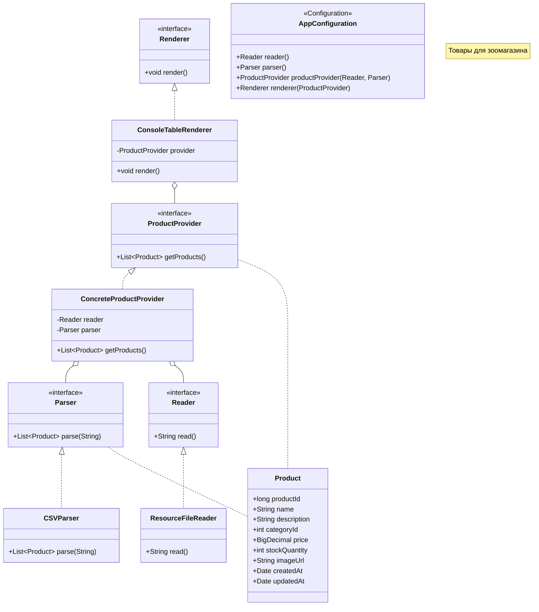

# Лабораторная работа №1. Gradle. Базовое приложение Spring

**Выполнил:** Муштенко Андрей Алексеевич

## Цель работы

Создать каркас консольного Spring-приложения на основе Java-конфигурации, реализовать загрузчик CSV-файла и вывод данных о товарах зоомагазина в виде таблицы в консоль.

## Используемые инструменты

- JDK 17
- Gradle 8.12
- Spring Context 6.2.2
- JUnit Jupiter 5.11.1

## Структура проекта

```
les02/lab
└── app
    └── src
        ├── main
        │   ├── java/ru/bsuedu/cad/lab
        │   │   ├── App.java
        │   │   ├── AppConfiguration.java
        │   │   ├── Product.java
        │   │   ├── Reader.java
        │   │   ├── ResourceFileReader.java
        │   │   ├── Parser.java
        │   │   ├── CSVParser.java
        │   │   ├── ProductProvider.java
        │   │   ├── ConcreteProductProvider.java
        │   │   ├── Renderer.java
        │   │   └── ConsoleTableRenderer.java
        │   └── resources
        │       └── product.csv
        └── test
```

## Что реализовано

- Консольное приложение с Java-конфигурацией Spring (`@Configuration`, `@Bean`).
- `ResourceFileReader` — читает `product.csv` из classpath через `ClassPathResource`.
- `CSVParser` — парсит CSV-строку в список объектов `Product`.
- `ConcreteProductProvider` — объединяет Reader и Parser, предоставляет список товаров.
- `ConsoleTableRenderer` — выводит товары в консоль в виде форматированной таблицы с выравниванием по ширине колонок.
- Точка входа `App` поднимает `AnnotationConfigApplicationContext` и вызывает `renderer.render()`.

## Диаграмма классов



## Инструкция по запуску

```bash
gradle run
```

## Ответы на вопросы для защиты

**1. Spring. Определение, назначение, особенности**
Spring — фреймворк для разработки Java-приложений. Основные цели: упрощение конфигурации, управление зависимостями через IoC-контейнер, интеграция с различными технологиями (JDBC, Web, Security и др.).

**2. Проблемы ручной сборки приложений**
Необходимость вручную управлять зависимостями (скачивать JAR-файлы, следить за версиями), отсутствие стандартизации процессов компиляции, тестирования и упаковки.

**3. Системы автоматической сборки**
- **Maven** — сборка на основе XML (`pom.xml`), декларативный подход, центральный репозиторий.
- **Gradle** — сборка на основе DSL (Groovy/Kotlin), гибкий и быстрый, поддерживает инкрементальную сборку.
- **Ant** — XML-скрипты без управления зависимостями, устаревший, требует ручной настройки.

**4. Типовая структура Java-проекта**
`src/main/java` — исходный код; `src/main/resources` — ресурсы; `src/test/java` — тесты; `build/` — артефакты сборки.

**5. Типы зависимостей в Gradle**
`implementation` — зависимость компиляции и выполнения; `testImplementation` — только для тестов; `runtimeOnly` — только во время выполнения; `compileOnly` — только при компиляции.

**6. Принцип инверсии управления (IoC)**
IoC означает, что управление созданием объектов и их зависимостями передаётся фреймворку (контейнеру), а не остаётся в коде приложения. Цель — снижение связности.

**7. Отличие IoC от внедрения зависимостей (DI)**
IoC — широкий принцип передачи управления. DI — конкретный способ реализации IoC, при котором зависимости передаются объекту извне (через конструктор, сеттер или поле).

**8. Принципы IoC**
- **Dependency Injection** — зависимости передаются объекту снаружи.
- **Service Locator** — объект сам запрашивает зависимости из реестра.
- **Factory** — создание объектов делегируется фабрике.

**9. Сцепление (Coupling) и связность (Cohesion)**
Coupling — степень зависимости одного модуля от другого (желательно низкое). Cohesion — степень единства ответственностей внутри модуля (желательно высокое).

**10. Предпочтительный принцип внедрения зависимостей**
Внедрение через конструктор: зависимости явны, объект всегда полностью инициализирован, удобно для тестирования (можно подставить мок без Spring).
