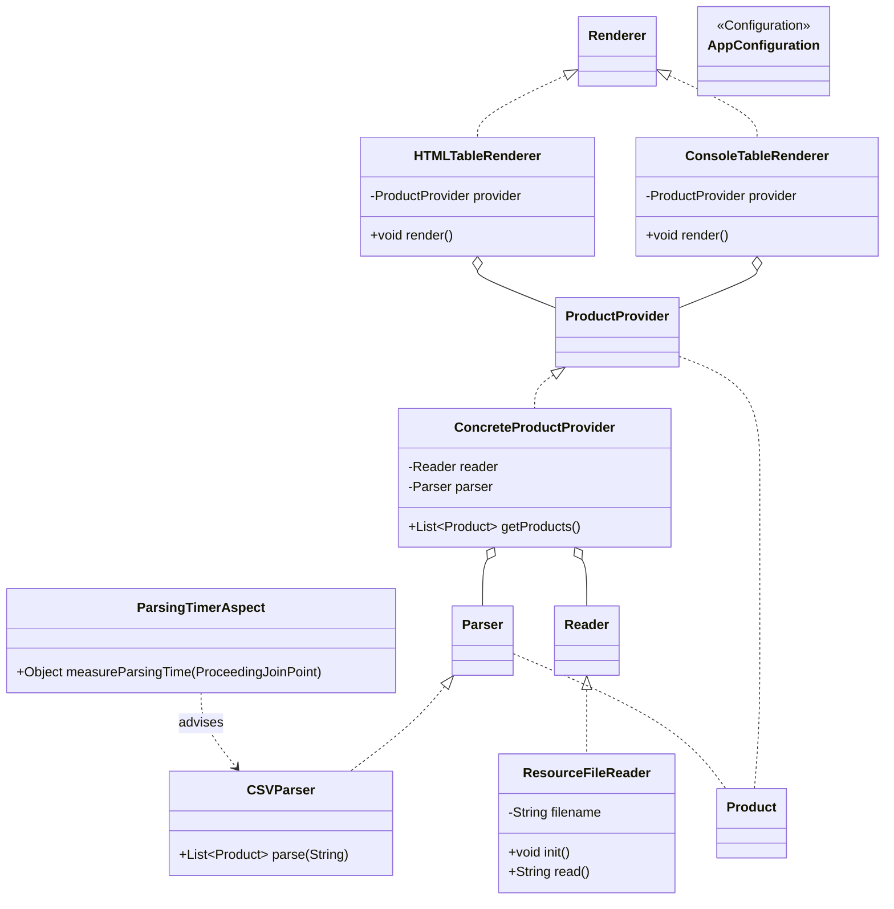

# Лабораторная работа №2. Конфигурирование Spring с помощью аннотаций. AOP

**Выполнил:** Муштенко Андрей Алексеевич

## Цель работы

Перейти на конфигурирование Spring-приложения через аннотации (`@Component`, `@Value`), добавить рендеринг в HTML-файл, вывод времени инициализации бина через `@PostConstruct` и замер времени парсинга CSV с помощью АОП.

## Используемые инструменты

- JDK 17
- Gradle 8.12
- Spring Context 6.2.2
- AspectJ Weaver
- Jakarta Annotation API 2.1.1
- JUnit Jupiter 5.11.1

## Структура проекта

```
les04/lab
└── app
    └── src
        ├── main
        │   ├── java/ru/bsuedu/cad/lab
        │   │   ├── App.java
        │   │   ├── AppConfiguration.java
        │   │   ├── Product.java
        │   │   ├── Reader.java
        │   │   ├── ResourceFileReader.java   (@Component, @Value, @PostConstruct)
        │   │   ├── Parser.java
        │   │   ├── CSVParser.java            (@Component)
        │   │   ├── ProductProvider.java
        │   │   ├── ConcreteProductProvider.java (@Component)
        │   │   ├── Renderer.java
        │   │   ├── ConsoleTableRenderer.java  (@Component)
        │   │   ├── HTMLTableRenderer.java     (@Component, @Primary)
        │   │   └── ParsingTimerAspect.java    (@Aspect, @Component)
        │   └── resources
        │       ├── product.csv
        │       └── application.properties
        └── test
```

## Что реализовано

- Конфигурирование через аннотации: `@ComponentScan`, `@PropertySource`, `@EnableAspectJAutoProxy` в `AppConfiguration`.
- `@Value("${product.file}")` в `ResourceFileReader` — имя CSV-файла берётся из `application.properties`.
- `@PostConstruct` в `ResourceFileReader` — выводит в консоль дату и время полной инициализации бина.
- `HTMLTableRenderer` с `@Primary` — генерирует HTML-файл `output.html`; используется по умолчанию вместо `ConsoleTableRenderer`.
- `ParsingTimerAspect` — `@Around`-совет на `CSVParser.parse()`, выводит время парсинга в миллисекундах.

## Диаграмма классов



## Инструкция по запуску

```bash
gradle run
```

После запуска в консоли появится время инициализации `ResourceFileReader` и время парсинга CSV. Файл `output.html` будет создан в рабочей директории.

## Ответы на вопросы для защиты

**1. Виды конфигурирования ApplicationContext**
XML-конфигурация (`ClassPathXmlApplicationContext`), Java-конфигурация (`AnnotationConfigApplicationContext` + `@Configuration`), аннотационная с автосканированием (`@ComponentScan`), Groovy DSL.

**2. Стереотипные аннотации**
`@Component` — базовый маркер бина; `@Service` — слой сервисов; `@Repository` — слой доступа к данным (+ обработка исключений); `@Controller` / `@RestController` — слой Web-контроллеров.

**3. Виды автоматического связывания (autowiring)**
- **по типу** (`@Autowired`) — Spring ищет бин совместимого типа;
- **по имени** (`@Qualifier("name")`) — уточнение при нескольких кандидатах;
- **через конструктор** — рекомендуемый способ;
- **через сеттер** — для опциональных зависимостей;
- **через поле** — краткий, но затрудняет тестирование.

**4. Внедрение простых параметров**
С помощью аннотации `@Value("значение")` или `@Value("${key}")` для чтения из properties-файла.

**5. Внедрение параметров через SpEL**
`@Value("#{бин.метод()}")` — вычисляется Spring Expression Language во время инициализации контекста.

**6. Режимы получения бинов (Scope)**
`singleton` (по умолчанию) — один экземпляр на контекст; `prototype` — новый экземпляр при каждом запросе; `request`, `session`, `application` — для Web-контекста.

**7. Жизненный цикл бинов**
Загрузка определения → создание экземпляра → внедрение зависимостей → вызов `@PostConstruct` → работа → вызов `@PreDestroy` → уничтожение.

**8. Что такое АОП?**
Аспектно-ориентированное программирование — парадигма, позволяющая вынести сквозную функциональность (логирование, транзакции, безопасность) в отдельные модули (аспекты).

**9. Типы АОП в Spring**
Spring AOP (прокси-based, только public-методы бинов) и интеграция с AspectJ (полноценное байт-код-ткачество).

**10. Виды Advice**
`@Before` — до метода; `@After` — после (независимо от исключения); `@AfterReturning` — после успешного завершения; `@AfterThrowing` — при исключении; `@Around` — оборачивает весь вызов.

**11. Виды Pointcut**
`execution` — по сигнатуре метода; `within` — по классу/пакету; `@annotation` — методы с заданной аннотацией; `bean` — по имени бина.

**12. Spring AOP vs AspectJ**
Spring AOP работает через JDK-прокси или CGLIB, применим только к бинам Spring, ткачество во время выполнения. AspectJ — полноценное байт-код-ткачество, применим к любым объектам, более производителен, но требует отдельного компилятора/weaver.
