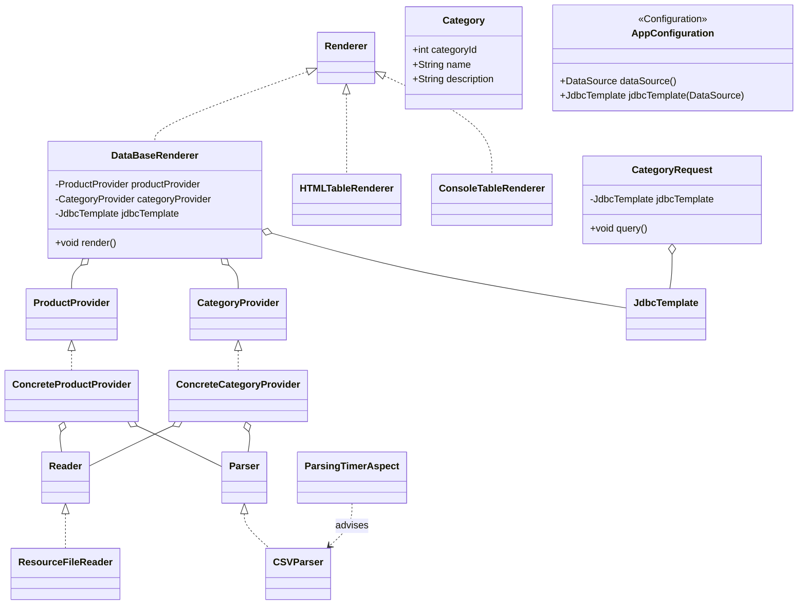

# Лабораторная работа №3. Технологии работы с базами данных. JDBC

**Выполнил:** Муштенко Андрей Алексеевич

## Цель работы

Добавить поддержку встраиваемой базы данных H2 через Spring JDBC, загружать данные из CSV-файлов в таблицы CATEGORIES и PRODUCTS с помощью `JdbcTemplate`, выполнять SQL-запрос к БД и выводить результаты через логгер.

## Используемые инструменты

- JDK 17
- Gradle 8.12
- Spring Context 6.2.2
- Spring JDBC 6.2.2
- H2 Database
- AspectJ Weaver
- Logback
- JUnit Jupiter 5.11.1

## Структура проекта

```
les06/lab
└── app
    └── src
        ├── main
        │   ├── java/ru/bsuedu/cad/lab
        │   │   ├── App.java
        │   │   ├── AppConfiguration.java     (DataSource + JdbcTemplate)
        │   │   ├── Product.java
        │   │   ├── Category.java
        │   │   ├── Reader.java / ResourceFileReader.java
        │   │   ├── Parser.java / CSVParser.java
        │   │   ├── ProductProvider.java / ConcreteProductProvider.java
        │   │   ├── CategoryProvider.java / ConcreteCategoryProvider.java
        │   │   ├── Renderer.java
        │   │   ├── DataBaseRenderer.java      (@Primary — сохраняет в БД)
        │   │   ├── HTMLTableRenderer.java
        │   │   ├── ConsoleTableRenderer.java
        │   │   ├── CategoryRequest.java       (SQL-запрос через JdbcTemplate)
        │   │   └── ParsingTimerAspect.java
        │   └── resources
        │       ├── product.csv
        │       ├── category.csv
        │       ├── schema.sql
        │       ├── application.properties
        │       └── logback.xml
        └── test
```

## Что реализовано

- `AppConfiguration` создаёт `EmbeddedDatabase` (H2) через `EmbeddedDatabaseBuilder`, выполняет `schema.sql` при старте.
- `schema.sql` создаёт таблицы `CATEGORIES` и `PRODUCTS` с внешним ключом `category_id`.
- `ConcreteCategoryProvider` — читает `category.csv` и предоставляет список объектов `Category`.
- `DataBaseRenderer` (`@Primary`) — вставляет категории и товары в БД через `JdbcTemplate.update()`.
- `CategoryRequest` — выполняет запрос `SELECT ... HAVING COUNT > 1` и выводит результат через `LOGGER.info()`.

## Диаграмма классов



## Инструкция по запуску

```bash
gradle run
```

В консоли появятся: время инициализации `ResourceFileReader`, время парсинга CSV и вывод категорий с более чем одним товаром (через logback INFO).

## Ответы на вопросы для защиты

**1. Что такое Spring JDBC и какие преимущества оно предоставляет?**
Spring JDBC — обёртка над стандартным JDBC. Устраняет шаблонный код (открытие/закрытие соединений, обработку checked-исключений), преобразует их в `DataAccessException`.

**2. Основной класс для работы с JDBC в Spring**
`JdbcTemplate` — центральный класс, предоставляет методы для выборки, вставки, обновления и удаления данных.

**3. Шаги настройки JDBC в Spring**
Объявить `DataSource` как бин → создать `JdbcTemplate(dataSource)` → внедрить `JdbcTemplate` в нужные компоненты.

**4. Основные методы JdbcTemplate**
`query()` — выборка списка объектов; `queryForObject()` — один объект; `update()` — INSERT/UPDATE/DELETE; `execute()` — DDL-операции.

**5. SELECT с получением объекта**
`jdbcTemplate.query("SELECT ...", (rs, n) -> new Entity(...))` — передаётся лямбда-`RowMapper`.

**6. Как использовать RowMapper**
`RowMapper<T>` — функциональный интерфейс с методом `mapRow(ResultSet rs, int rowNum)`, преобразует строку результата в объект.

**7. Вставка данных через JdbcTemplate**
`jdbcTemplate.update("INSERT INTO t (a, b) VALUES (?, ?)", val1, val2)` — возвращает число изменённых строк.

**8. UPDATE/DELETE через JdbcTemplate**
Аналогично INSERT — метод `update()` с соответствующим SQL и параметрами.

**9. Обработка исключений**
Spring JDBC автоматически преобразует `SQLException` в иерархию непроверяемых исключений `DataAccessException`.

**10. Альтернативы JdbcTemplate**
`NamedParameterJdbcTemplate` (именованные параметры), Spring Data JPA/Hibernate (ORM), jOOQ, MyBatis.
