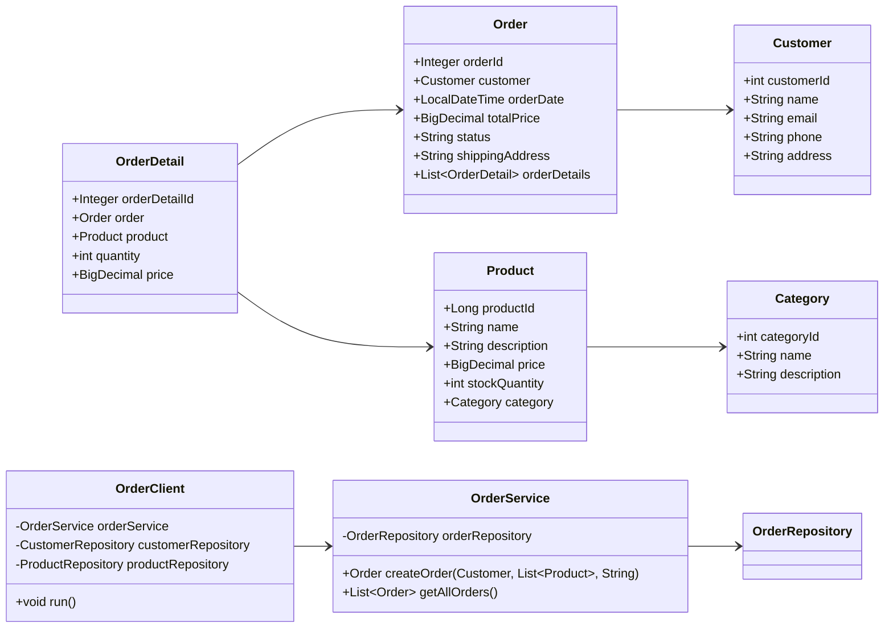

# Лабораторная работа №4. Технологии работы с базами данных. JPA. Spring Data

**Выполнил:** Муштенко Андрей Алексеевич

## Цель работы

Перейти с Spring JDBC на JPA/Hibernate, реализовать полную доменную модель магазина (категории, товары, клиенты, заказы, позиции заказа), подключить Spring Data JPA-репозитории и продемонстрировать создание заказа в транзакции.

## Используемые инструменты

- JDK 17
- Gradle 8.12
- Spring Context 6.2.2
- Spring Data JPA 3.x
- Hibernate 6.x
- HikariCP
- H2 Database
- Logback
- JUnit Jupiter 5.11.1

## Структура проекта

```
les08/lab
└── app
    └── src
        └── main
            └── java/ru/bsuedu/cad/lab
                ├── AppConfiguration.java
                ├── entity
                │   ├── Category.java
                │   ├── Product.java
                │   ├── Customer.java
                │   ├── Order.java
                │   └── OrderDetail.java
                ├── repository
                │   ├── CategoryRepository.java
                │   ├── ProductRepository.java
                │   ├── CustomerRepository.java
                │   ├── OrderRepository.java
                │   └── OrderDetailRepository.java
                ├── service
                │   └── OrderService.java
                └── app
                    ├── App.java
                    ├── DataLoader.java
                    └── OrderClient.java
```

## Что реализовано

- `AppConfiguration` настраивает `HikariDataSource`, `LocalContainerEntityManagerFactoryBean` (Hibernate DDL auto-create), `JpaTransactionManager`.
- JPA-сущности: `Category`, `Product` (`@ManyToOne` к Category), `Customer`, `Order` (`@ManyToOne` к Customer, `@OneToMany` к OrderDetail), `OrderDetail` (`@ManyToOne` к Order и Product).
- Spring Data репозитории (`JpaRepository`) для всех пяти сущностей.
- `DataLoader` загружает данные из CSV-файлов в БД при старте.
- `OrderService.createOrder()` — транзакционный метод, создаёт `Order` с позициями, считает сумму, сохраняет через `OrderRepository.save()`.
- `OrderClient` — демонстрирует вызов сервиса и вывод всех заказов в лог.

## Диаграмма классов



## Инструкция по запуску

```bash
gradle run
```

В логах будет виден созданный заказ и список всех заказов из БД.

## Ответы на вопросы для защиты

### JPA

**1. Что такое JPA и для чего оно используется?**
JPA (Jakarta Persistence API) — стандарт ORM для Java. Описывает маппинг объектов на таблицы БД и API для работы с ними через `EntityManager`.

**2. Чем JPA отличается от Hibernate?**
JPA — спецификация (интерфейс); Hibernate — реализация этой спецификации (провайдер).

**3. Что делает аннотация @Entity?**
Помечает класс как JPA-сущность — таблицу в базе данных.

**4. Для чего нужна @Table?**
Задаёт имя таблицы в БД. Без неё используется имя класса.

**5. Как обозначить первичный ключ?**
Аннотация `@Id` над полем. Обычно дополняется `@GeneratedValue`.

**6. Что делает @GeneratedValue?**
Указывает стратегию генерации значения PK (IDENTITY, SEQUENCE, AUTO, TABLE).

**7. Стратегии генерации идентификаторов**
`IDENTITY` — автоинкремент БД; `SEQUENCE` — последовательность БД; `TABLE` — вспомогательная таблица; `AUTO` — выбирает провайдер.

**8. @Column(name = ...) vs имя поля напрямую**
Без `@Column` Hibernate использует имя поля как имя столбца. `@Column(name)` задаёт явное имя столбца.

**9. Связь @OneToMany**
На стороне «один» ставится `@OneToMany(mappedBy = "fieldName")`, на стороне «много» — `@ManyToOne` + `@JoinColumn`.

**10. Связь @ManyToMany**
Аннотация `@ManyToMany` на обеих сторонах; `@JoinTable` задаёт промежуточную таблицу.

### Spring Data

**1. Что такое Spring Data и зачем оно нужно?**
Spring Data — проект, упрощающий работу с различными хранилищами данных через единую абстракцию репозиториев.

**2. Что делает CrudRepository?**
Предоставляет базовые CRUD-методы: `save`, `findById`, `findAll`, `delete`, `deleteById`, `count`.

**3. Чем JpaRepository отличается от CrudRepository?**
`JpaRepository` расширяет `PagingAndSortingRepository` и `CrudRepository`, добавляет методы пакетного удаления, сбросов `flush` и работу с Pageable/Sort.

**4. Как создать репозиторий?**
Объявить интерфейс, расширяющий `JpaRepository<Entity, IdType>`, — Spring Data создаст реализацию автоматически.

**5. Поиск по ID**
`repository.findById(id)` — возвращает `Optional<T>`.

**6. Добавление новой записи**
`repository.save(entity)` — INSERT если id null, иначе UPDATE.

**7. Удаление объекта**
`repository.deleteById(id)` или `repository.delete(entity)`.

**8. Свой SQL-запрос**
`@Query("SELECT ... FROM ...")` над методом репозитория (JPQL или native SQL с `nativeQuery = true`).

**9. Что такое @Transactional?**
Аннотация, оборачивающая метод в транзакцию. При исключении выполняется откат.

**10. Аннотации для работы с JPA-сущностями**
`@Entity`, `@Table`, `@Id`, `@GeneratedValue`, `@Column`, `@ManyToOne`, `@OneToMany`, `@JoinColumn`, `@Transactional`.
