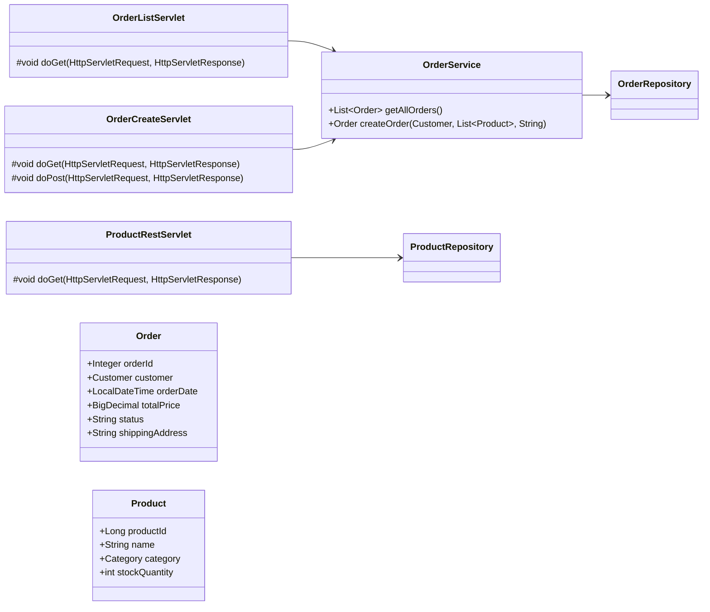

# Лабораторная работа №5. Разработка и развёртывание Web-приложений. Сервлеты

**Выполнил:** Муштенко Андрей Алексеевич

## Цель работы

Добавить Web-интерфейс к приложению зоомагазина с использованием Java Servlet API: реализовать страницы списка и создания заказа, а также REST-сервлет для получения данных о товарах в JSON. Развернуть приложение на Apache Tomcat 11.

## Используемые инструменты

- JDK 17
- Gradle 8.12
- Spring Context / Data JPA 6.x / 3.x
- Hibernate 6.x, HikariCP, H2
- Jakarta Servlet API 6.0
- Apache Tomcat 11
- Logback

## Структура проекта

```
les10/lab
└── app
    └── src
        └── main
            ├── java/ru/bsuedu/cad/lab
            │   ├── AppConfiguration.java
            │   ├── entity/           (Category, Product, Customer, Order, OrderDetail)
            │   ├── repository/       (5 JpaRepository)
            │   ├── service/
            │   │   └── OrderService.java
            │   ├── app/
            │   │   ├── DataLoader.java
            │   │   └── OrderClient.java
            │   └── servlet/
            │       ├── OrderListServlet.java
            │       ├── OrderCreateServlet.java
            │       └── ProductRestServlet.java
            └── webapp/WEB-INF/web.xml
```

## Что реализовано

- `OrderListServlet` (`GET /orders`) — отображает HTML-таблицу со всеми заказами, кнопка перехода к форме создания.
- `OrderCreateServlet` (`GET /create-order`) — форма с выбором клиента, товаров (multiple select) и адреса доставки. `POST` — создаёт заказ и редиректит на `/orders`.
- `ProductRestServlet` (`GET /api/products`) — возвращает JSON-массив с названием товара, категорией и остатком на складе.
- Все сервлеты получают Spring-бины через `WebApplicationContextUtils.getWebApplicationContext()`.
- Сборка WAR: `gradle war`, деплой в Tomcat 11.

## Диаграмма классов



## Примеры запросов

**Список заказов (браузер/curl):**
```bash
curl http://localhost:8080/app/orders
```

**REST: список товаров с категорией и остатком:**
```bash
curl http://localhost:8080/app/api/products
```

Пример ответа:
```json
[
  {"name":"Сухой корм для собак","category":"Корма","stockQuantity":50},
  {"name":"Игрушка для кошек \"Мышка\"","category":"Игрушки","stockQuantity":200},
  {"name":"Лакомство для попугаев","category":"Лакомства","stockQuantity":100}
]
```

**Создание заказа (форма):**
```
POST http://localhost:8080/app/create-order
Content-Type: application/x-www-form-urlencoded

customerId=1&productIds=1&productIds=3&address=Москва+ул.+Ленина+1
```

## Инструкция по запуску

```bash
# 1. Собрать WAR
gradle war
# WAR-файл: app/build/libs/app.war

# 2. Скопировать в Tomcat (контекстный путь будет /app)
copy app\build\libs\app.war %TOMCAT_HOME%\webapps\app.war

# 3. Запустить Tomcat
%TOMCAT_HOME%\bin\startup.bat

# 4. Открыть в браузере
# Список заказов:  http://localhost:8080/app/orders
# Создать заказ:   http://localhost:8080/app/create-order
# REST товары:     http://localhost:8080/app/api/products
```

## Ответы на вопросы для защиты

**1. Что такое Servlet и зачем он нужен?**
Servlet — Java-класс, обрабатывающий HTTP-запросы на стороне сервера. Является основой Java EE Web-приложений.

**2. Что делает web.xml?**
Дескриптор развёртывания: регистрирует сервлеты, фильтры, листенеры, задаёт URL-маппинги и параметры контекста.

**3. WAR vs JAR**
JAR — архив Java-классов и ресурсов. WAR (Web Application Archive) — специальный JAR с структурой `WEB-INF/`, предназначенный для деплоя в контейнер сервлетов.

**4. Что такое ServletContext?**
Общий объект контекста всего Web-приложения, доступный всем сервлетам. Хранит атрибуты уровня приложения и позволяет получить ресурсы.

**5. HttpServletRequest vs HttpServletResponse**
`HttpServletRequest` — данные входящего запроса (параметры, заголовки, тело). `HttpServletResponse` — объект для формирования ответа (статус, заголовки, вывод).

**6. Listener при запуске приложения**
Нужно реализовать `ServletContextListener` — метод `contextInitialized()` вызывается при старте приложения.

**7. Доступ к Spring ApplicationContext из сервлета**
`WebApplicationContextUtils.getWebApplicationContext(getServletContext())` — возвращает Spring-контекст, загруженный `ContextLoaderListener`.

**8. Что делает ContextLoaderListener?**
Загружает корневой Spring `ApplicationContext` при старте Web-приложения и помещает его в `ServletContext`.

**9. @WebServlet vs web.xml**
`@WebServlet` — аннотационная регистрация прямо в классе, проще для небольших приложений. `web.xml` — централизованная конфигурация, нужна для задания параметров инициализации и порядка загрузки.

**10. Один Spring Bean в нескольких сервлетах**
Через общий `WebApplicationContext`, полученный из `ServletContext`. Все сервлеты обращаются к одному и тому же синглтон-бину.
