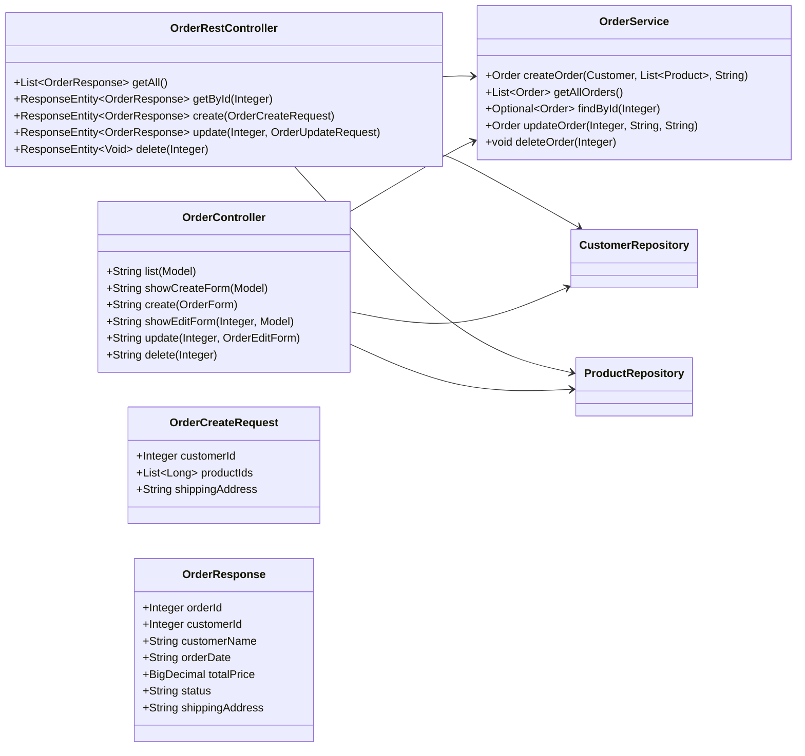

# Лабораторная работа №6. Spring MVC + Thymeleaf + REST API

**Выполнил:** Муштенко Андрей Алексеевич

## Цель работы

Перейти от сервлетов к Spring MVC: реализовать полноценный REST API для управления заказами (`@RestController`) и веб-интерфейс на Thymeleaf (`@Controller`). Развернуть приложение на Apache Tomcat 11.

## Используемые инструменты

- JDK 17
- Gradle 8.12
- Spring Web MVC 6.2.x
- Spring Data JPA 3.x
- Hibernate 6.x, HikariCP, H2
- Thymeleaf 3.1.x
- Jackson (сериализация JSON)
- Apache Tomcat 11

## Структура проекта

```
les12/lab
└── app
    └── src
        └── main
            ├── java/ru/bsuedu/cad/lab
            │   ├── AppConfiguration.java
            │   ├── AppInitializer.java         (замена web.xml)
            │   ├── entity/
            │   ├── repository/
            │   ├── service/
            │   │   └── OrderService.java
            │   ├── app/DataLoader.java
            │   └── controller/
            │       ├── OrderRestController.java (@RestController /api/orders)
            │       ├── OrderController.java     (@Controller /orders)
            │       ├── OrderResponse.java
            │       ├── OrderCreateRequest.java
            │       ├── OrderUpdateRequest.java
            │       ├── OrderForm.java
            │       └── OrderEditForm.java
            └── webapp/WEB-INF/views/
                ├── orders.html
                ├── order-form.html
                └── order-edit.html
```

## Что реализовано

- `AppInitializer` регистрирует `DispatcherServlet` без `web.xml`.
- `AppConfiguration` настраивает Thymeleaf ViewResolver, Jackson, JPA/Hibernate.
- `OrderRestController` — полный CRUD REST API по адресу `/api/orders`.
- `OrderController` — Thymeleaf-страницы: список, создание, редактирование, удаление заказов.
- `OrderService` расширен методами `findById`, `updateOrder`, `deleteOrder`.

## Диаграмма классов



## Примеры запросов (curl / Postman)

**Получить все заказы:**
```bash
curl -X GET http://localhost:8080/api/orders
```

**Получить заказ по ID:**
```bash
curl -X GET http://localhost:8080/api/orders/1
```

**Создать заказ:**
```bash
curl -X POST http://localhost:8080/api/orders \
  -H "Content-Type: application/json" \
  -d '{"customerId": 1, "productIds": [1, 2], "shippingAddress": "Москва"}'
```

**Обновить статус заказа:**
```bash
curl -X PUT http://localhost:8080/api/orders/1 \
  -H "Content-Type: application/json" \
  -d '{"status": "SHIPPED", "shippingAddress": "Новый адрес"}'
```

**Удалить заказ:**
```bash
curl -X DELETE http://localhost:8080/api/orders/1
```

## Инструкция по запуску

```bash
gradle war
# Скопировать build/libs/*.war в $TOMCAT_HOME/webapps/ROOT.war
# Запустить Tomcat: startup.bat / startup.sh
# Веб-интерфейс:  http://localhost:8080/orders
# Создать заказ:  http://localhost:8080/orders/new
# REST API:       http://localhost:8080/api/orders
```

## Ответы на вопросы для защиты

**1. Что означает MVC и его компоненты?**
MVC — Model-View-Controller. Model — данные и бизнес-логика; View — отображение (шаблон); Controller — обработка запроса, связывает Model и View.

**2. Роль DispatcherServlet**
Центральный фронт-контроллер Spring MVC. Принимает все HTTP-запросы и направляет их нужным обработчикам (контроллерам).

**3. Аннотация для класса-контроллера**
`@Controller` (возвращает имя представления) или `@RestController` (возвращает данные в теле ответа).

**4. @Controller vs @RestController**
`@RestController = @Controller + @ResponseBody`. Все методы возвращают данные напрямую (JSON/XML), а не логическое имя View.

**5. Аннотация для переменной из URL**
`@PathVariable` — привязывает часть URL (`/orders/{id}`) к параметру метода.

**6. Что такое Model в Spring MVC?**
Интерфейс для передачи данных от контроллера в шаблон. `model.addAttribute("key", value)` делает значение доступным в Thymeleaf как `${key}`.

**7. Что делает @RequestMapping?**
Связывает URL-шаблон и/или HTTP-метод с методом контроллера. Дочерние аннотации: `@GetMapping`, `@PostMapping`, `@PutMapping`, `@DeleteMapping`.

**8. HTTP-методы и аннотации**
GET — `@GetMapping`; POST — `@PostMapping`; PUT — `@PutMapping`; DELETE — `@DeleteMapping`; PATCH — `@PatchMapping`.

**9. ViewResolver и его назначение**
Преобразует логическое имя представления (строку, возвращаемую контроллером) в конкретный объект View. `ThymeleafViewResolver` ищет `.html`-шаблон в `WEB-INF/views/`.

**10. Как вернуть JSON без шаблонов?**
Использовать `@RestController` или аннотировать метод `@ResponseBody`. Jackson автоматически сериализует возвращаемый объект в JSON.
