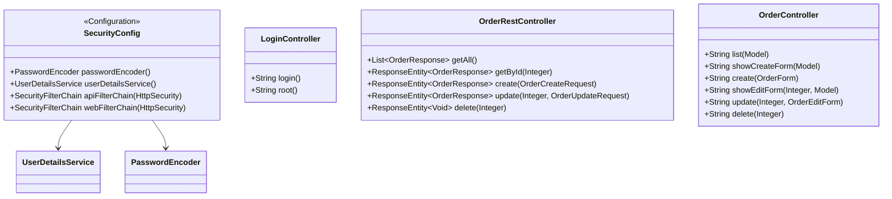

# Лабораторная работа №7. Spring Security. Form Login + Basic Authentication

**Выполнил:** Муштенко Андрей Алексеевич

## Цель работы

Добавить аутентификацию и авторизацию в приложение зоомагазина: форм-логин для веб-интерфейса и Basic Auth для REST API, настроить два пользователя с разными ролями.

## Используемые инструменты

- JDK 17
- Gradle 8.12
- Spring Security 6.x
- Spring Web MVC 6.x
- Spring Data JPA 3.x
- Hibernate 6.x, HikariCP, H2
- Thymeleaf 3.1.x
- Apache Tomcat 11

## Структура проекта

```
les14/lab
└── app
    └── src
        └── main
            └── java/ru/bsuedu/cad/lab
                ├── AppConfiguration.java
                ├── AppInitializer.java
                ├── SecurityConfig.java          (две SecurityFilterChain)
                ├── entity/
                ├── repository/
                ├── service/OrderService.java
                ├── app/DataLoader.java
                └── controller/
                    ├── OrderRestController.java
                    ├── OrderController.java
                    ├── LoginController.java
                    └── (DTO-классы)
```

## Что реализовано

- `SecurityConfig` (@EnableWebSecurity) содержит два независимых `SecurityFilterChain`:
  - **apiFilterChain** (приоритет 1) — защищает `/api/**`, использует **HTTP Basic Auth**, CSRF отключён. Роль `USER` — только GET, роль `MANAGER` — все операции.
  - **webFilterChain** (приоритет 2) — защищает `/orders/**` и `/login`, использует **Form Login** с кастомной страницей `/login`. Роль `USER` — только `GET /orders`, роль `MANAGER` — все операции.
- `UserDetailsService` — `InMemoryUserDetailsManager` с двумя пользователями: `user/user123` (USER) и `manager/manager123` (MANAGER).
- Пароли хешируются через `BCryptPasswordEncoder`.
- `LoginController` обслуживает `GET /login` → шаблон `login.html`, и `GET /` → редирект на `/orders`.

## Диаграмма классов



## Матрица доступа

| URL / Метод                        | USER    | MANAGER |
|------------------------------------|---------|---------|
| `GET /orders`                      | ✅      | ✅      |
| `POST /orders`, `DELETE`, `PUT`    | ❌      | ✅      |
| `GET /api/orders`                  | ✅      | ✅      |
| `POST /api/orders`, `PUT`, `DELETE`| ❌      | ✅      |

## Примеры запросов с Basic Auth

**GET заказов (оба пользователя):**
```bash
curl -u user:user123 http://localhost:8080/api/orders
```

**Создание заказа (только manager):**
```bash
curl -u manager:manager123 -X POST http://localhost:8080/api/orders \
  -H "Content-Type: application/json" \
  -d '{"customerId":1,"productIds":[1,2],"shippingAddress":"Москва"}'
```

**Обновление заказа (только manager):**
```bash
curl -u manager:manager123 -X PUT http://localhost:8080/api/orders/1 \
  -H "Content-Type: application/json" \
  -d '{"status":"SHIPPED","shippingAddress":"Новый адрес"}'
```

**Удаление заказа (только manager):**
```bash
curl -u manager:manager123 -X DELETE http://localhost:8080/api/orders/1
```

**Попытка user создать заказ — 403 Forbidden:**
```bash
curl -u user:user123 -X POST http://localhost:8080/api/orders \
  -H "Content-Type: application/json" \
  -d '{"customerId":1,"productIds":[1],"shippingAddress":"Адрес"}'
```

## Инструкция по запуску

```bash
gradle war
# Скопировать build/libs/*.war в $TOMCAT_HOME/webapps/ROOT.war
# Запустить Tomcat: startup.bat / startup.sh
# Вход (форм-логин): http://localhost:8080/login
# Список заказов:    http://localhost:8080/orders
# REST API:          http://localhost:8080/api/orders
```

## Ответы на вопросы для защиты

**1. Что такое Spring Security и зачем он используется?**
Фреймворк для аутентификации (кто ты?) и авторизации (что тебе можно?) в Spring-приложениях. Реализован через цепочку фильтров сервлетов.

**2. Аутентификация vs авторизация**
Аутентификация — подтверждение личности (логин/пароль). Авторизация — проверка прав доступа к ресурсу.

**3. SecurityFilterChain и его роль**
Цепочка фильтров, обрабатывающих HTTP-запрос до попадания в контроллер. Каждый фильтр отвечает за свой аспект безопасности (аутентификация, CSRF, заголовки и т.д.).

**4. Как работает form-based аутентификация?**
Незаутентифицированный пользователь перенаправляется на страницу логина. После успешной отправки формы Spring Security создаёт сессию и `SecurityContext`.

**5. Что такое UserDetailsService?**
Интерфейс с методом `loadUserByUsername()`. Spring Security вызывает его при аутентификации, чтобы загрузить данные пользователя (логин, пароль, роли).

**6. Как задать роли и проверять их?**
В `UserDetails` через `.roles("ROLE_NAME")`. В конфигурации: `.hasRole("MANAGER")` или `.hasAnyRole("USER","MANAGER")`. В коде: `@PreAuthorize("hasRole('MANAGER')")`.

**7. Что такое Basic Authentication?**
Механизм HTTP-аутентификации: логин и пароль передаются в заголовке `Authorization: Basic base64(login:password)`. Прост, не требует сессии, подходит для REST API.

**8. Как запретить доступ к URL без роли?**
В `SecurityFilterChain`: `.authorizeHttpRequests(auth -> auth.requestMatchers("/admin/**").hasRole("ADMIN"))`.

**9. Кастомная страница логина**
`formLogin(form -> form.loginPage("/login").permitAll())` — задаёт URL кастомной страницы; сам URL должен быть обработан контроллером.

**10. Можно ли совмещать form login и basic auth?**
Да — через два отдельных `SecurityFilterChain` с разными `securityMatcher`, как в данной работе: один для `/api/**` (Basic), другой для `/orders/**` (Form Login).
