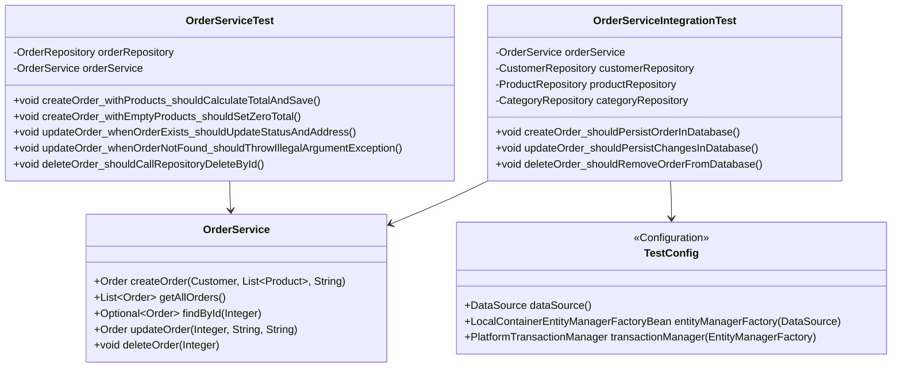

# Лабораторная работа №8. Основы тестирования. Unit + Integration тесты. JaCoCo

**Выполнил:** Муштенко Андрей Алексеевич

## Цель работы

Написать модульные (unit) и интеграционные тесты для `OrderService`, настроить JaCoCo для измерения покрытия кода тестами.

## Используемые инструменты

- JDK 17
- Gradle 8.12
- JUnit Jupiter 5.11.x
- Mockito 5.x
- AssertJ
- Spring Test 6.x
- Hibernate 6.x, HikariCP, H2 (тестовая БД)
- JaCoCo

## Структура тестов

```
les16/lab
└── app
    └── src
        └── test
            └── java/ru/bsuedu/cad/lab
                ├── TestConfig.java                          (Spring-контекст для интеграционных тестов)
                └── service/
                    ├── OrderServiceTest.java                (Unit-тесты с Mockito)
                    └── OrderServiceIntegrationTest.java     (Интеграционные тесты с H2)
```

## Что реализовано

### Unit-тесты (`OrderServiceTest`)

Используют `@ExtendWith(MockitoExtension.class)`, `OrderRepository` замокан через `@Mock`.

| Тест | Проверяет |
|------|-----------|
| `createOrder_withProducts_shouldCalculateTotalAndSave` | Корректный подсчёт суммы, статус NEW, сохранение |
| `createOrder_withEmptyProducts_shouldSetZeroTotal` | Сумма = 0 при пустом списке товаров |
| `createOrder_shouldSetStatusNew` | Статус всегда NEW при создании |
| `getAllOrders_shouldDelegateToRepository` | Делегирование в репозиторий |
| `getAllOrders_whenEmpty_shouldReturnEmptyList` | Пустой список |
| `findById_whenOrderExists_shouldReturnOrder` | Найден заказ по ID |
| `findById_whenOrderNotExists_shouldReturnEmpty` | Optional.empty при отсутствии |
| `updateOrder_whenOrderExists_shouldUpdateStatusAndAddress` | Обновление статуса и адреса |
| `updateOrder_whenOrderNotFound_shouldThrowIllegalArgumentException` | Исключение при несуществующем ID |
| `deleteOrder_shouldCallRepositoryDeleteById` | Вызов `deleteById` в репозитории |

### Интеграционные тесты (`OrderServiceIntegrationTest`)

Используют `@ExtendWith(SpringExtension.class)`, `@ContextConfiguration(classes = TestConfig.class)`, `@Transactional`. БД H2 in-memory с `hibernate.hbm2ddl.auto = create-drop`.

| Тест | Проверяет |
|------|-----------|
| `createOrder_shouldPersistOrderInDatabase` | Заказ сохраняется и читается из БД |
| `createOrder_withMultipleProducts_shouldCalculateTotalCorrectly` | Сумма из нескольких товаров |
| `getAllOrders_shouldReturnCreatedOrders` | Все созданные заказы возвращаются |
| `updateOrder_shouldPersistChangesInDatabase` | Изменения записываются в БД |
| `updateOrder_withNonExistentId_shouldThrowException` | Исключение при несуществующем ID |
| `deleteOrder_shouldRemoveOrderFromDatabase` | Заказ удаляется из БД |

### TestConfig

Отдельная конфигурация Spring для тестов: H2 in-memory (`testdb`), `hbm2ddl.auto = create-drop`, сканирует только `service` и `repository` пакеты.

## Диаграмма классов



## Инструкция по запуску тестов и отчёта JaCoCo

```bash
# Запустить все тесты
gradle test

# Сформировать отчёт JaCoCo
gradle jacocoTestReport

# Отчёт находится в:
# app/build/reports/jacoco/test/html/index.html
```

## Ответы на вопросы для защиты

**1. Модульное vs интеграционное тестирование**
Модульное — тестирует один класс/метод в изоляции (зависимости заменяются моками). Интеграционное — тестирует взаимодействие нескольких компонентов (реальная БД, реальный Spring-контекст).

**2. Фреймворки для модульного тестирования в Java**
JUnit 5 (Jupiter) — основной фреймворк; Mockito — создание моков; AssertJ — гибкие assertions; TestNG — альтернатива JUnit.

**3. Зачем нужны stubs и mocks?**
Stubs возвращают заранее заданные данные. Mocks дополнительно проверяют, что определённые методы были вызваны. Оба нужны для изоляции тестируемого класса от внешних зависимостей.

**4. Что тестируется в unit-тесте?**
Логика одного класса: корректность вычислений, обработка граничных случаев, правильность взаимодействия с зависимостями (через verify).

**5. Как обеспечить изоляцию тестируемого класса?**
Заменить реальные зависимости моками (`@Mock` + `@InjectMocks` в Mockito) и настроить их поведение через `when().thenReturn()`.

**6. Можно ли в unit-тесте подключать БД?**
Технически можно, но нежелательно: замедляет тесты, нарушает изоляцию. Для проверки работы с БД предназначены интеграционные тесты.

**7. Что проверяется при интеграционном тестировании?**
Взаимодействие слоёв: сервис ↔ репозиторий ↔ БД. Корректность SQL-запросов, транзакционность, каскадные операции.

**8. Какие компоненты нужны для интеграционного теста?**
Реальный Spring-контекст, реальная (или тестовая in-memory) БД, реальные репозитории и сервисы.

**9. Преимущество H2 при интеграционном тестировании**
Лёгкая встраиваемая БД, запускается в памяти без внешних зависимостей, схема создаётся и удаляется автоматически (`create-drop`). Тесты быстры и воспроизводимы.

**10. Как понять, что тест интеграционный, а не модульный?**
Интеграционный тест поднимает реальный контекст (Spring, БД), не использует моки для основных зависимостей, проверяет сквозное поведение нескольких компонентов.
